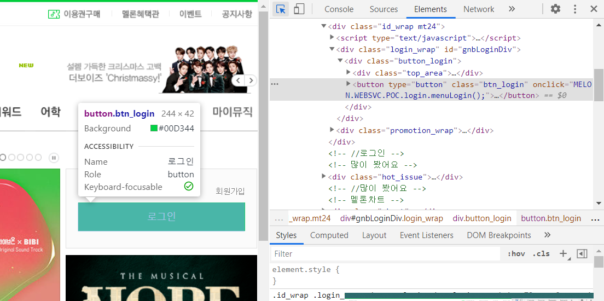
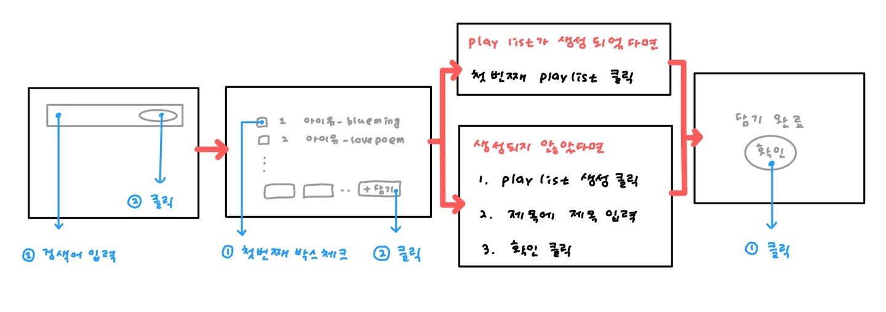
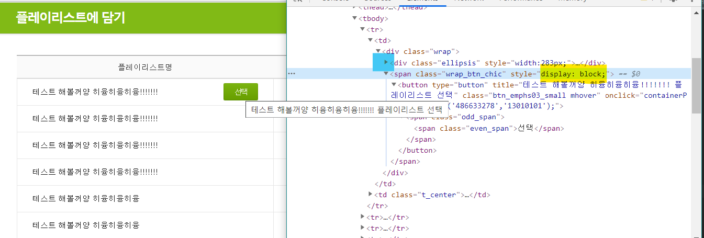
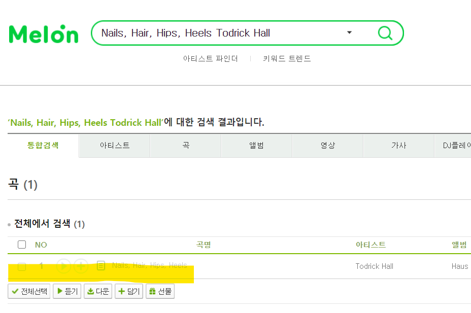
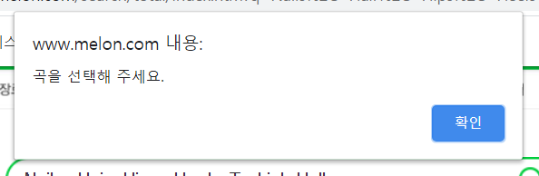
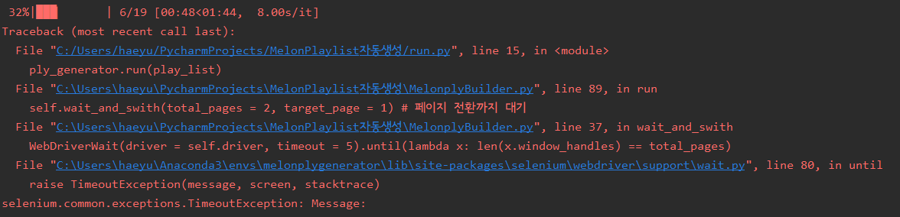

# Melon-playlist-generater

### 언제 검색하고 언제 추가해? 곡 목록만 입력하면 자동으로 멜론에 플레이 리스트를 생성합니다.


[Title-Based-Playlist-Generator](https://github.com/haeuuu/Title-Based-Playlist-Generator)의 연장선에 있는 Repository!  

내가 입력한 제목에서 태그를 추출한 후 유사한 노래들을 찾아 플레이 리스트를 생성했다.  

만들었으니 이용하고 싶다. 하지만 이를 일일이 추가하기란 너~무 너무 귀찮다 !  

"제목만 입력해도 음악을 들을 수 있는 서비스"가 목적인데 자동화가 안되면 의미가 없다고 생각한다.

그래서 ! 자동으로 멜론에 접속해서 플레이 리스트를 생성해주는 프로그램을 만들어보려고 한다.

파이썬 selenium을 이용해서 구현했고 코드는 [이곳](https://oboki.net/workspace/python/selenium%EC%9D%84-%EC%9D%B4%EC%9A%A9%ED%95%9C-melon-playlist-%EC%B6%94%EA%B0%80-%EC%9E%90%EB%8F%99%ED%99%94/)을 참고했다.


클릭/검색 등 하나의 action은 크게 다음 두가지 단계를 거친다.

1. 조작하고 싶은 element의 xpath 혹은 id를 찾고
   * id는 유일하다! 즉 id가 있다면 xpath 보다는 `find_element_by_id()`로 간단하게 끝낼 수 있다.
2. click, send_keys 등을 통해 명령한다.

이 때 창 생성, 삭제, 전환 등을 고려해야 하고 숨겨진 버튼이 있다면 보여지도록 처리가 필요하다.


## selenium과 chromdriver 설치하기

> https://chromedriver.chromium.org/downloads


## Xpath 다루는 법





`F12`를 눌러 왼쪽 위의 커서 버튼을 클릭하자.

element를 선택할 수 있도록 활성화된다.

내가 원하는 element(여기서는 로그인 버튼)을 누르면, 해당하는 xml으로 이동한다.

오른쪽 마우스를 눌러 xpath를 copy하거나 id를 확인해 명령하자 !


로그인에 성공했다면 xpath, click, send_keys 를 이용하는 다른 모든 명령도 수월하게 짤 수 있다 !


## playlist 생성하고 채워넣기



간단한 로직으로 playlist를 생성하고 채워나갈 수 있다. action 하나하나 써보자.

1. 원하는 노래 제목을 입력한다.

2. 검색 버튼을 클릭한다.

3. 가장 상위에 나온 결과를 선택한다.
 
4. 담기 버튼을 클릭한다.

5. 플레이리스트 선택 창이 생성된다. 대기 및 창 전환을 한다. (page = 1로)

6. 1. 만약 내가 지정한 title로 playlist가 생성되었다면, 첫번째 리스트에 추가한다.

      >  여기서 숨겨진 버튼에 대한 처리가 필요하다.

   2. 그렇지 않다면 playlist를 생성한다.

      1. 생성 버튼을 클릭한다.
      2. 제목을 입력한다.
      3. 확인을 클릭한다.

5. 담기 완료창에 대한 확인 버튼을 클릭한다.

6. 새로운 검색을 위해 다시 창을 전환한다. (page = 0으로)


## 창 관리하기

어떤 버튼은 새로운 창에 결과를 띄워준다.

새롭게 생긴 창에서 작업을 시작하고 싶다면 창전환을 명령해야 한다.

`WebDriverWait`를 통해 새로운 창이 생길 때까지 대기하도록 하고, `drive.swith_to.window`를 이용해 원하는 창으로 이동하자.


```python
# total_pages ; 총 몇 개의 창이 될 때까지 대기할 것인가?
# target_page : 이동하고자 하는 page index (생성 시간 순으로 0,1,2 ...)

WebDriverWait(driver = self.driver, timeout = 5).until(lambda x: len(x.window_handles) == total_pages)
self.driver.switch_to.window(self.driver.window_handles[target_page])
```


## 숨겨진 버튼 누르기

마우스가 올라가면 동적으로 반응해서 생기는 버튼인 경우, 일반적인 코드로는 클릭할 수 없다.

(스크롤을 해야 데이터가 더 나오는 경우 등 역시 동적이므로 처리할 수 없다.)

`ElementNotInteractableException` 에러를 해결해보자.


#### 1. 반자동 방식

먼저 찾은 해결책은 아래인데, `내가 원하는 XML_tag`가 활성화될 때까지 최대 20초를 기다리는 코드이다.

자동으로 돌리다가, 버튼이 숨겨진 페이지를 만나면 내가 직접 마우스를 올려서 활성화되도록 해야만 돌아간다.

이렇게되면 플레이 리스트 선택창이 나올 때마다 직접 마우스를 움직여줘야 한다... 탈락!

```python
WebDriverWait(driver, 20).until(EC.element_to_be_clickable((By.XPATH,'내가 원하는 XML_tag''))).click()
```


#### 2. XML 강제 수정

버튼을 숨기는 att인 `display : none`을 강제로 `display : block`으로 바꾼 후 실행시키는 방법이다.

선택버튼은 각 플레이 리스트의 `<td>` 내부에 들어있다. 버튼은 그것보다 몇단계 더 들어가야 있다.


`<button type ... >` 위에 감싸진 `<div class = 'wrap_btn_chic' style = 'display:block;'>` 를 확인해보자.

지금은 버튼을 활성화 한채로 눌러서 `block`으로 되어있지만, 기본값은 `none`이다.


다음 절차로 코딩하면 이제 버튼을 누를 수 있다 !

1. `wrap_btn_chic` element에 접근해서
2. `display : none`을  `display : block`으로 바꾸고
3. 다시 `button`에 접근해서 클릭한다.

```python
# 버튼이 보이도록 wrapper에 접근하여 att 수정
element = driver.find_element_by_xpath('//*[@id="plylstList"]/div/table/tbody/tr[1]/td[1]/div/span')
print("init :",element.get_attribute('style'))
driver.execute_script("arguments[0].setAttribute('style','display:block;')",element)
print('changed :',element.get_attribute('style'))

# 버튼에 접근한 후 클릭
botton = driver.find_element_by_xpath('//*[@id="plylstList"]/div/table/tbody/tr[1]/td[1]/div/span/button')
botton.click()
```





처음에는 이렇게 해도 여전히 `ElementNotInteractableException`였다.

botton 자체에 접근해서 attr를 수정했기 때문이다 !!

해당 attr가 들어있는 `wrap`로 접근해서 수정해야한다 !

```python
botton = driver.find_element_by_xpath('//*[@id="plylstList"]/div/table/tbody/tr[1]/td[1]/div/span/button')
driver.execute_script("arguments[0].setAttribute('style','display:block;')",check_button)
check_button.click() # ERROR
```


## 경고창 관리하기

특히 팝송의 경우에는 음원이 갑자기 막히는 경우가 자주 일어난다.

이런 경우에는 아래처럼 체크박스가 활성화되지 않기 때문에, 아무것도 체크하지 않고 담기 버튼을 누르게 되므로






곡 선택을 하지 않았다는 에러가 발생한다.




## + XML

컴퓨터에게 이 버튼을 클릭해! 라고 명령을 주어야 하는데 '이 버튼'이 무슨 버튼인지 어떻게 알려줘야 할까?

페이지 내의 텍스트, 그림, 버튼 등의 정보는 모두 XML 형태로 저장되어 있다.

XML은 문서가 tree 형태로 저장되고, 내가 원하는 data가 어느 노드를 타고 내려가야 있는지만 알려주면 된다. 이러한 path를 Xpath라고 한다.


#### XML?

> eXtensible Markup Language
>
> 확장성 : 새로운 태그를 계속해서 만들어 붙일 수 있다.

* Markup Language 의 예 : HTML

* HTML은 이미 약속된 태그만 사용할 수 있다. 그러나 XML은 사용자 정의 태그를 사용할 수 있다.
* 전자는 데이터를 보여주기 위한 목적이고 후자는 데이터를 저장/전달하기 위한 목적이다.
* XML은 태그를 통해 데이터에 대한 설명을 제공한다.


#### Xpath?

> https://uuukpyo.tistory.com/14

XML 문서의 특정 요소/속성에 접근하기 위한 경로를 지정하는 언어.

트리 형태로 구성되고 /, // 등을 이용하여 루트노드와 자식노드를 찾아 탐색한다.


#### F12 개발자 도구로 Xpath 찾기

1. `F12` 로 개발자 도구를 연다.
2. 개발자 도구의 왼쪽 위, 또는 `ctrl+shift+c`를 눌러 탐색 기능을 활성화한다.
3. Xpath를 알고자 하는 정보를 클릭한다.
4. 하이라이트된 XML을 이용해서 조작한다!
